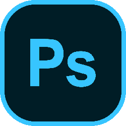

# Hi, I'm Aliaksandr👋

I am passionate about web development and eager to apply my skills in a professional setting. My goal is to gain hands-on experience in front-end development and contribute to meaningful projects.

## About Me 🚀

## My Skills 🔪

## Contact Me 📞

- Location: Grodno, Belarus
- GitHub: 
- Instagram: 
