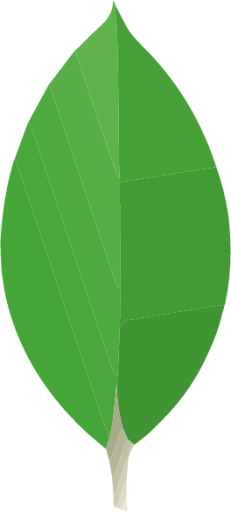

# Hi, I'm Aliaksandr👋

I am passionate about web development and eager to apply my skills in a professional setting. My goal is to gain hands-on experience in front-end development and contribute to meaningful projects.

## About Me 🚀

{:target="_blank"}
{:target="_blank"}
{:target="_blank"}
{:target="_blank"}

## My Skills 🔪

{:target="_blank"}
{:target="_blank"}
{:target="_blank"}
{:target="_blank"}
{:target="_blank"}
{:target="_blank"}
{:target="_blank"}
{:target="_blank"}
{:target="_blank"}
{:target="_blank"}
{:target="_blank"}
{:target="_blank"}

## Some Projects 🎓

| Project Title | Deploy | Description |Stack|
| ------------- | ------------ | ------------|------------ |
| Project 1 | [Project 1]() | | |
| Project 2 | [Project 2]() | | |
| Project 3 | [Project 3]() | | |
| **RS CSS** | [RS CSS](https://rolling-scopes-school.github.io/spacepocket1985-JSFE2023Q1/rs-css/){:target="_blank"} |Trainer for learning css selectors |**JavaScript, TypeScript, HTML, CSS, SPA, Webpack** |
| **Virtual keyboard** | [Virtual keyboard](https://spacepocket1985.github.io/virtual-keyboard/){:target="_blank"} |Classic virtual keyboard for Windows |**JavaScript, HTML, CSS, SPA** |
| **Shelter** | [Shelter](https://rolling-scopes-school.github.io/spacepocket1985-JSFE2023Q1/shelter/index.html){:target="_blank"} |Shelter is a pet shelter website that is adaptive and interactive. |**JavaScript, HTML, CSS** |
