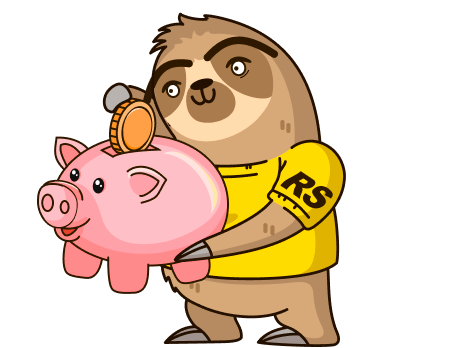

# Hi, I'm Aliaksandr👋

Interested in an internship or job as a junior front-end developer. I have knowledge of HTML, CSS, JavaScript, and experience working with frameworks. Purposeful, quick learner and ready to develop my skills in the IT field. Anyway time goes fast and

> when you think it’s too late, the truth is, it’s still early.

## About Me 🚀

## My Skills 🔪

## Some Projects 🎓

| Project Title | Deploy | Description |Stack|
| ------------- | ------------ | ------------|------------ |
| **Employment center**| [Employment center](https://github.com/spacepocket1985/employmentCenter) |Employment center, with the ability to add, delete and edit vacancies.  An application developed in TypeScript and consisting of a backend and a frontend. |**TypeScript, React, Redux, Material-UI, React Router,Node.js, Express ,Mongoose, SPA** |
| **Food order**| [Food order](https://food9999order.netlify.app/) |Small app for ordering food. |**TypeScript, React, Vite, Eslint SPA** |
| **RS CSS** | [RS CSS](https://rolling-scopes-school.github.io/spacepocket1985-JSFE2023Q1/rs-css/) |Trainer for learning css selectors |**JavaScript, TypeScript, HTML, CSS, SPA, Webpack** |
| **Virtual keyboard** | [Virtual keyboard](https://spacepocket1985.github.io/virtual-keyboard/) |Classic virtual keyboard for Windows |**JavaScript, HTML, CSS, SPA** |
| **Shelter** | [Shelter](https://rolling-scopes-school.github.io/spacepocket1985-JSFE2023Q1/shelter/index.html) |Shelter is a pet shelter website that is adaptive and interactive. |**JavaScript, HTML, CSS** |
| **CSS Bayan** | [CSS Bayan](https://spacepocket1985.github.io/cssBayan/) |An accordion with HTML and CSS only. |**HTML, CSS** |

## Сompleted RS School courses 💻
| React | JavaScript/Front-end  | JavaScript/Front-end preschool|
| ------------- | -------------  | -------------|
|  |  | |

## СodeWars 🐯

